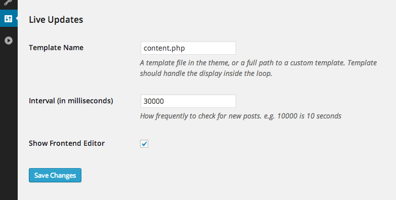
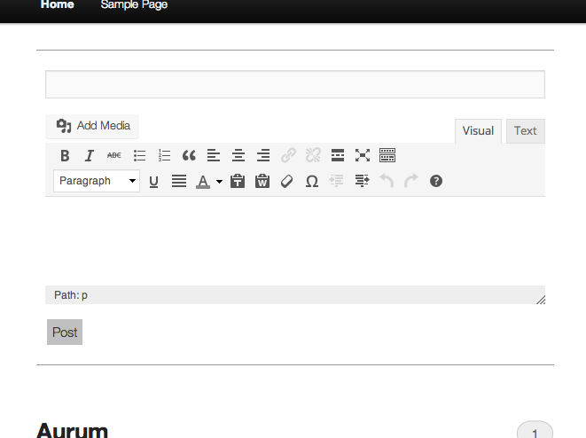

Live Updates
============

In development!
---------------

*Settings* > *Reading* > *Live Updates*

Automatically loads any posts published after page load.

Adds an editor to the frontend.

Future
------
* Comment support